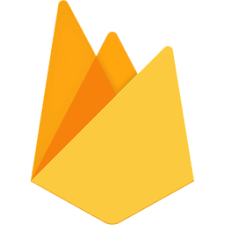

> <h2> Tecnologias 🔥</h2>

<ul>
    <li><a href='https://pt-br.reactjs.org/'>React</a></li>
    <li><a href='https://www.typescriptlang.org/'>Typescript</a></li>
    <li><a href='https://firebase.google.com/?hl=pt'>Firebase</a></li>
</ul>

> <h2> Projeto ✨</h2>

Letmeask é um projeto com o intuito de ajudar na organização de Q&A com a criação de salas privadas disponíveis ao seu público .

> <h2>Executando o projeto 🚀</h2>

    <ol>
    <li> Clone o repositório </l1>
    <li> Instale o <a href='https://yarnpkg.com/'><code>yarn</code></a>
    <li> Instale as dependências também com <a href='https://yarnpkg.com/'><code>yarn</code></a>
    <li> Inicie o projeto com <code>yarn start</code>
    </ol>

> <h3> Considerações finais</h3>

    
Feito com muito amor junto da equipe da <a href='https://rocketseat.com.br/'>Rocket</a> ❤️

    
Por fim caso queira testar antes de instalar em sua máquina o projeto está hospedado em <a href='https://letmeask-843c4.web.app/'>https://letmeask-843c4.web.app/ </a>

